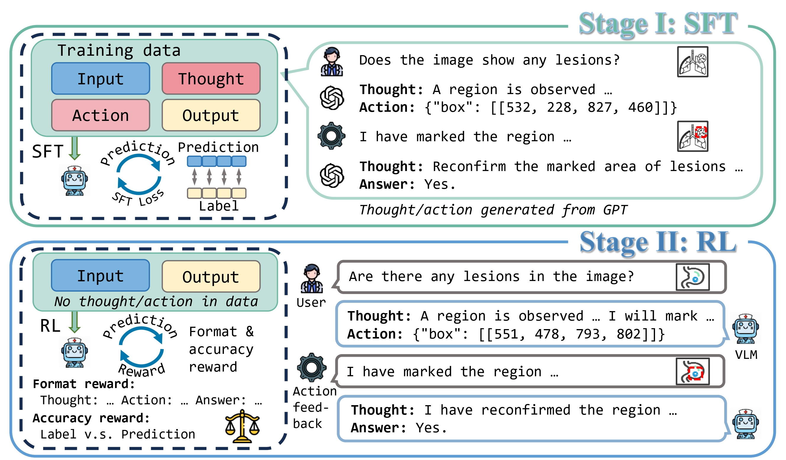

#  Think Twice to See More: Iterative Visual Reasoning in Medical VLMs

## 📖 Overview  

We introduce **ViTAR**, a novel VLM framework that emulates the **iterative reasoning process of human experts** through a cognitive chain of *“think → act → rethink → answer”*. ViTAR treats medical images as **interactive cognitive objects**, enabling models to perform **multi-step visual reasoning**.  

Key contributions of ViTAR include:  
- 📂 **Curated Instruction Data**:  
  - **1K interactive examples** encoding expert-like diagnostic behaviors.  
  - **16K VQA training samples** targeting fine-grained visual diagnosis.  
- 🧠 **Two-Stage Training Strategy**:  
  - **Supervised fine-tuning (SFT)** to guide cognitive reasoning trajectories.  
  - **Reinforcement learning (RL)** to optimize diagnostic decision-making.  
- 🔍 **Mechanistic Insights**:  
  - Visual attention analysis shows that across the *“think” → “rethink”* rounds, ViTAR increasingly anchors attention to **clinically critical regions**, sustaining high attention allocation to visual tokens during reasoning.  

 

---

## 🧠 Framework  

  

 A framework of ViTAR.
  

