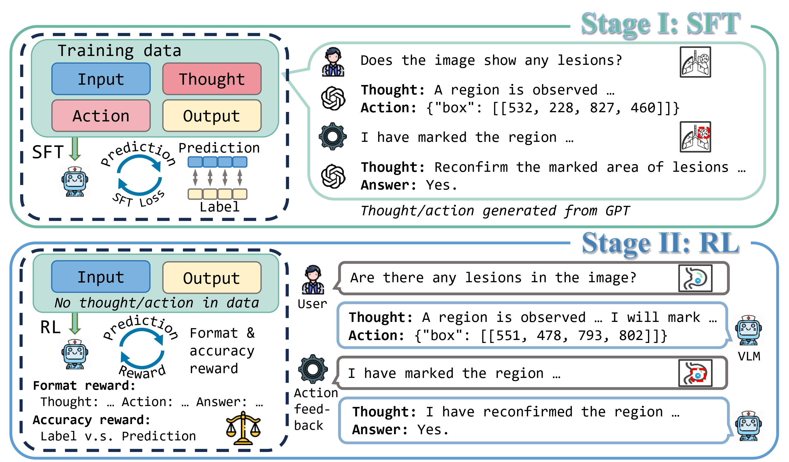

#  Think Twice to See More: Iterative Visual Reasoning in Medical VLMs

<p align="center">
  <a href="https://arxiv.org/abs/2510.10052">
    
  </a>
  <a href="https://huggingface.co/datasets/jline/ViTAR-18K">
    
  </a>
  <a href="https://jlinekai.github.io/ViTAR-Project/">
    
  </a>
</p>

## 📖 Overview  

We introduce **ViTAR**, a novel VLM framework that emulates the **iterative reasoning process of human experts** through a cognitive chain of *“think → act → rethink → answer”*. ViTAR treats medical images as **interactive cognitive objects**, enabling models to perform **multi-step visual reasoning**.  

Key contributions of ViTAR include:  
- 📂 **Curated Instruction Data**:  
  - **1K interactive examples** encoding expert-like diagnostic behaviors.  
  - **16K VQA training samples** targeting fine-grained visual diagnosis.  
- 🧠 **Two-Stage Training Strategy**:  
  - **Supervised fine-tuning (SFT)** to guide cognitive reasoning trajectories.  
  - **Reinforcement learning (RL)** to optimize diagnostic decision-making.  
- 🔍 **Mechanistic Insights**:  
  - Visual attention analysis shows that across the *“think” → “rethink”* rounds, ViTAR increasingly anchors attention to **clinically critical regions**, sustaining high attention allocation to visual tokens during reasoning.  


<!-- ## 🧠 Framework   -->
<div align="center">
  

 A framework of ViTAR.
  

</div>

## 🚀 Getting Started
We provide a quick guide for setting up the environment, training ViTAR, and running inference/evaluation.
### Environments
First, install all dependencies:

```bash
cd ViTAR
pip install -r requirements.txt
```


### Two-Stage Training 
ViTAR adopts a two-stage training pipeline:

**1. Supervised Fine-tuning (SFT):**
Trains the model to follow expert-like reasoning trajectories.

```bash
bash train_ViTAR_SFT.sh
```
**2. Reinforcement Learning (RL):**
Further optimizes diagnostic decision-making via iterative visual reasoning.
```bash
bash train_ViTAR_RL.sh
```

### Inference
After training, you can run ViTAR in inference mode:

Run interactive script based on vllm.
```bash
bash run_ViTAR.sh
```
Direct inference.
```bash
python inference.py
```
### Evaluation
We provide an evaluation script for benchmarking on medical VQA datasets:

```bash
python eval_medvqa.py
```


